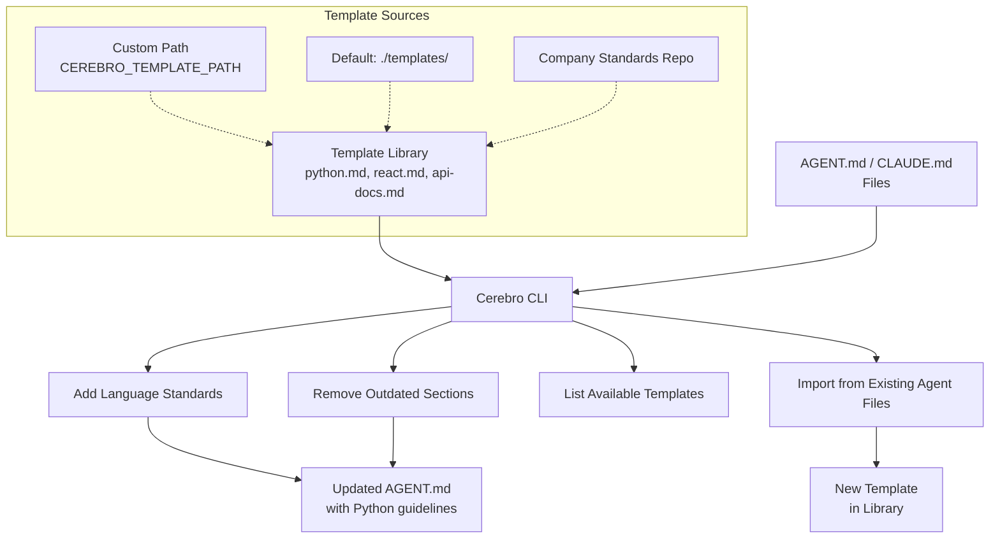

# Cerebro

[](https://github.com/three-broke-girls/cerebro/actions/workflows/ci.yml)
[](https://badge.fury.io/js/@three-broke-girls%2Fcerebro)
[](https://opensource.org/licenses/MIT)
[](https://nodejs.org/)

> *"Managing AGENT.md and CLAUDE.md files shouldn't be a chore"*

I built Cerebro because I was constantly rebuilding AGENT.md and CLAUDE.md files from scratch for every AI project. You know the drill: new project, copy-paste Python guidelines from that one project three months ago, find the React patterns from another repo, dig through old files for API documentation standards. It got old fast.

Cerebro is a CLI tool specifically designed to help developers manage and maintain their AI agent configuration files (AGENT.md, CLAUDE.md) by providing a simple template system.

## What Problem Does This Solve?

If you're building AI-powered applications, you've probably got AGENT.md files that define your agent's capabilities, coding standards, and behavior patterns. Maybe you're using CLAUDE.md files to configure Claude Code workflows. Either way, you're probably:

- Copying the same language-specific guidelines between projects
- Forgetting which project had the best API documentation template
- Spending time recreating coding standards you've already written
- Maintaining inconsistent agent configurations across projects

Cerebro fixes this by letting you build a library of reusable sections that you can mix and match across all your AI agent files.

## How It Works



## Common Use Cases

- **New AI Project**: Quickly scaffold AGENT.md with your preferred coding standards
- **Team Consistency**: Share template libraries to ensure all agent files follow company patterns
- **Language Standards**: Maintain consistent Python, JavaScript, Go guidelines across projects
- **Agent Behavior Patterns**: Reuse proven agent instruction templates
- **Claude Code Setup**: Standardize CLAUDE.md configurations for development workflows

## Features That'll Make You Smile

- **Add templates to any markdown file** with a simple command
- **Remove sections** when they overstay their welcome
- **List all your templates** like a boss
- **Import sections** from existing files (because recycling is good for the environment)
- **Configurable template library** – keep your templates wherever your heart desires
- **Battle-tested** with comprehensive tests (because we're professionals, sort of)

## Quick Start

### Installation

#### From npm (Recommended)

```bash
# Install globally with npm
npm install -g @three-broke-girls/cerebro

# Or with yarn
yarn global add @three-broke-girls/cerebro
```

#### From Source

```bash
# Clone the repository
git clone https://github.com/three-broke-girls/cerebro.git
cd cerebro

# Install dependencies
yarn install

# Make it globally available
yarn link
```

### Your First Steps

```bash
# See what agent templates you've got
cerebro list

# Add Python guidelines to your AGENT.md (default target)
cerebro add python

# Add React patterns to a specific CLAUDE.md file
cerebro add react -f CLAUDE.md

# Remove a section when you don't need it anymore
cerebro remove python

# Import a section from another agent file
cerebro import api-standards ../other-project/AGENT.md
```

## Real-World Examples

### Setting Up a New AI Project

You're starting a new Python AI project and need to configure your agent:

```bash
# Check what templates you have
$ cerebro list
Available templates:
  - python
  - api-docs
  - testing-patterns
  - claude-code-config

# Add Python standards to your AGENT.md
$ cerebro add python
Added section 'python' to AGENT.md

# Add API documentation guidelines
$ cerebro add api-docs
Added section 'api-docs' to AGENT.md
```

Your AGENT.md now contains:
```markdown
# AI Agent Configuration

This agent specializes in Python development with API integration.

## python

This project uses the following Python coding standards and conventions:

### Dependency Management
- Use `uv` for dependency management and running scripts.

### Naming Convention
- `snake_case` for variable and method names
- `PascalCase` for class names
- `UPPER_SNAKE_CASE` for constants

### Best Practices
- All code should follow PEP 8 guidelines.
- Use meaningful variable and function names.
- Always use type hints for function signatures.
- Use f-strings for string formatting.

## api-docs

When creating API documentation, follow these guidelines:

### REST API Standards
- Use clear, descriptive endpoint names
- Include request/response examples
- Document all error codes and responses
```

### Importing from Existing Projects

Found a great agent configuration in another project? Bring it over:

```bash
# Import Claude Code configuration from another project
$ cerebro import claude-setup ../successful-project/CLAUDE.md
Imported template 'claude-setup' from ../successful-project/CLAUDE.md

# Now use it in your current project
$ cerebro add claude-setup -f CLAUDE.md
Added section 'claude-setup' to CLAUDE.md
```

### Team Workflow

Your team shares a template repository:

```bash
# Point to your team's shared templates
export CEREBRO_TEMPLATE_PATH=/shared/ai-templates

# Everyone gets the same standards
cerebro add company-python-standards
cerebro add react-agent-patterns
cerebro add api-integration-guidelines
```

## Configuration

Don't like the default `./templates/` folder? No problem. Point Cerebro to your own template stash:

```bash
# Use your own template library
export CEREBRO_TEMPLATE_PATH=/path/to/your/awesome/templates

# Now cerebro will look there instead
cerebro list
```

Maybe you keep all your templates in Dropbox, or you have a company-wide template repo. Whatever works for you.

## Template Structure

Templates are just markdown files sitting in a folder. That's it. No magic, no complex configuration:

```
templates/
├── python.md      # Your Python wisdom
├── javascript.md  # JS best practices
├── go.md         # Go standards
└── api-docs.md   # API documentation template
```

When you run `cerebro add python`, it grabs `python.md` and plops the content into your target file as a new `## python` section. Simple as that.

## Development

Want to contribute? We love contributors almost as much as we love good documentation!

```bash
# Run tests (because we're responsible adults)
yarn test

# Lint your code (because clean code is happy code)
yarn lint

# Run the full CI pipeline locally
yarn ci

# Watch tests during development
yarn test:watch
```

## Why "Cerebro"?

Because like Professor X's Cerebro, this tool helps you find things. Except instead of finding mutants, it finds your markdown templates. And unlike the X-Men version, ours won't give you a headache or require psychic powers to operate.

## Contributing

Found a bug? Have a feature request? Want to tell us how amazing this tool is? We're all ears!

1. Fork it
2. Create your feature branch (`git checkout -b feature/amazing-feature`)
3. Commit your changes (`git commit -m 'Add some amazing feature'`)
4. Push to the branch (`git push origin feature/amazing-feature`)
5. Open a Pull Request

## License

MIT License - because we believe in sharing the love (and the code).

## Final Words

Remember: A good template is like a good joke – if you have to explain it, it's probably not that good. But unlike jokes, templates get better with age and reuse.

Happy templating!

---

*Made with coffee and a healthy dose of procrastination*